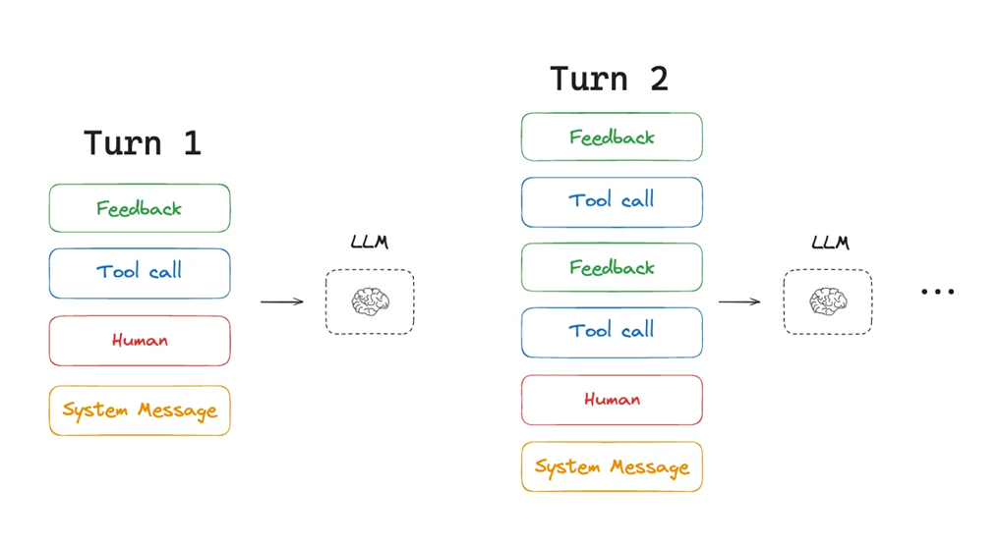
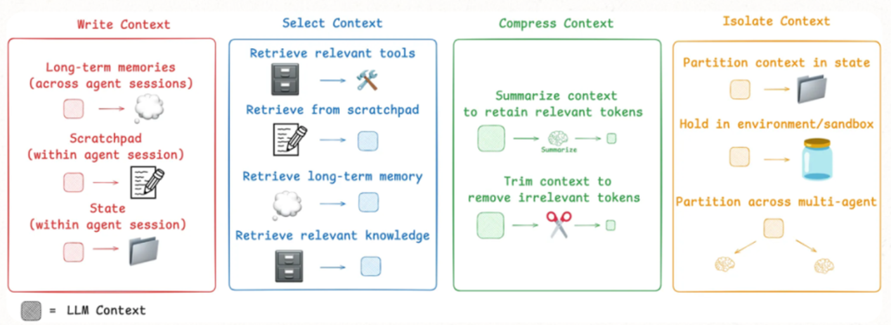
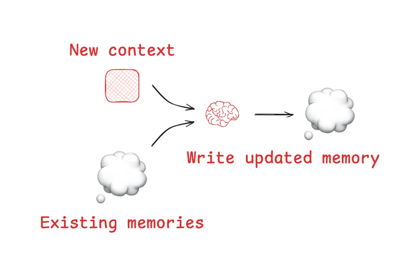
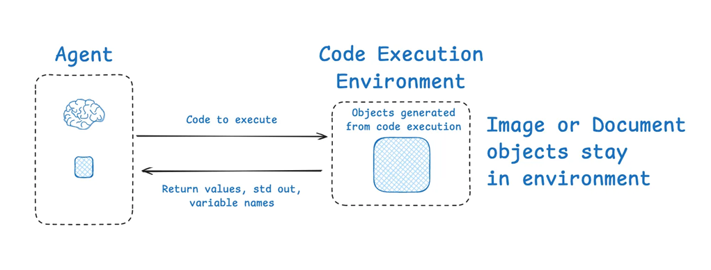
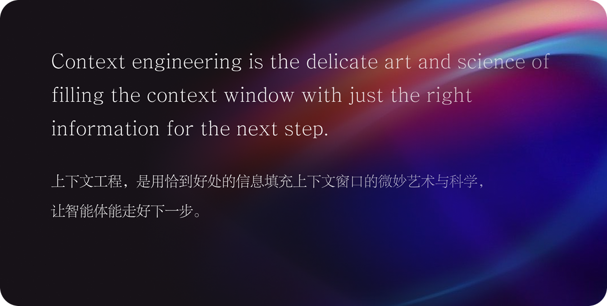

# 上下文工程补充知识

## 引入

为什么上下文工程最近又再次火热起来？源自 Chroma 创始人兼 CEOJeff在 Len Space [播客](https://youware.app/project/7529x70z4p)的对话，
Chroma 向量数据库领域的开源霸主。连大名鼎鼎的 Voyager 论文里用的都是它。
CEOJeff 对话的标题就是关于“RAG is dead”的观念，在视频中很明显的说明了原本的RAG的局限性和现在context engnieer的重要性，


本章我们先全面讲解一下“上文工程”的（context engnieer）概念， 
并在文章最后谈一下对 Rag is dead 的看法


## 什么是上下文工程？

我们可以打一个比方，Agent就像一种[新型操作系统](https://www.youtube.com/watch?si=-aKY-x57ILAmWTdw&t=620&v=LCEmiRjPEtQ&feature=youtu.be&ref=blog.langchain.com)。LLM如同CPU，其[上下文窗口](https://docs.anthropic.com/en/docs/build-with-claude/context-windows?ref=blog.langchain.com)如同RAM，作为模型的工作内存。就像RAM一样，LLM上下文窗口的[容量有限](https://lilianweng.github.io/posts/2023-06-23-agent/?ref=blog.langchain.com)，无法处理各种来源的上下文。而上下文工程就像操作系统管理CPU的RAM一样，去管理LLM的上下文窗口，决定在何时去填充什么内容。[Karpathy总结得很好](https://x.com/karpathy/status/1937902205765607626?ref=blog.langchain.com)：
_"上下文工程是...在上下文窗口中为下一步填充恰到好处信息的精妙艺术和科学。"_


## [上下文工程的概念](https://blog.langchain.com/context-engineering-for-agents/`)


Context就是模型“看到”的一切，模型其实并不是只根据我们输入的prompt回复问题，还有其余的信息配合生成回复。上下文工程作为适用于几种不同上下文类型的总括：

- **Instructions（指令上下文）** : 提示、记忆、少量示例等 prompt engineering，包括：
  - 系统提示词：定义AI的角色、行为准则和响应风格
  - 用户指令：描述具体任务及要求
  - 少样本示例：输入输出示例，帮助理解预期格式
  - 工具描述：函数或工具的规范与使用说明
  - 格式约束：输出的格式和结构要求
- **Knowledge（知识上下文）** : 事实、知识库等  rag，包括：
  - 领域知识：特定行业或专业的事实信息
  - 记忆：用户偏好、历史交互和会话记录
  - 知识库：从数据库或知识库中获取相关信息
  - 实时数据：动态更新的当前状态信息
- **Tools（工具上下文）** : 工具描述和工具调用的反馈 agent，包括：
  - 函数调用结果：API响应或查询结果
  - 工具执行状态：成功、失败或错误反馈
  - 多步骤工具链：工具间的依赖关系与数据传递
  - 执行历史：工具调用的记录与结果


### 例子——旅游APP的智能助手


为了清晰地区分这四个概念，我们设定一个统一的实际场景，然后看每个方法如何解决这个问题。

**场景：一个旅游APP的智能助手**

**用户需求：** “帮我规划一个为期三天的北京家庭旅行。我们是两个大人和一个5岁的孩子，喜欢历史文化，也想要一些轻松有趣的活动。我们的总预算是8000元。”

---

#### 1. 提示词工程 (Prompt Engineering)

这是最基础、最直接的方法。它的核心是**如何向语言模型（LLM）提一个好问题**，以期它仅凭其内部的通用知识库就能给出最好的答案。

*   **核心思想：** 优化输入给模型的指令（Prompt），让它输出更符合期望的结果。
*   **工作方式：**
    1.  开发者或用户将所有需求精心构造成一个详细的提示词。
    2.  将这个提示词直接发送给一个通用的大语言模型（如 GPT-4）。
    3.  模型完全依赖其截至训练日期（比如 2023 年）的内部知识进行回答。

*   **例子：**
    ```
    你是一位专业的旅行规划师。请为北京一个为期三天的家庭旅行设计一份详细行程。
    
    # 家庭成员
    - 2个成年人
    - 1个5岁的儿童
    
    # 兴趣偏好
    - 历史文化（故宫、长城等）
    - 轻松有趣的儿童活动
    
    # 预算
    - 总预算不超过8000元人民币，请给出大致的费用估算。
    
    # 输出要求
    - 每日行程安排（上午、下午、晚上）
    - 交通建议
    - 餐饮推荐（包含适合儿童的餐厅）
    - 预算明细
    ```

*   **局限性：**
    *   **信息过时：** 无法提供实时的门票价格、开放时间或最新的交通信息。
    *   **信息不准确：** 预算估算可能非常粗略，因为它不知道当前的酒店和机票价格。
    *   **缺乏个性化：** 无法根据用户的历史偏好进行推荐。
    *   **“一本正经地胡说八道”：** 可能会编造一些不存在的“儿童乐园”或餐厅。

---

#### 2. 检索增强生成 (RAG)

为了解决提示词工程“知识陈旧”的问题，RAG 引入了**外部知识库**。

*   **核心思想：** 在生成答案前，先从一个特定的、可信的数据库中检索相关信息，然后将这些信息和用户问题一起提供给模型。
*   **工作方式：**
    1.  **知识库准备：** 提前准备好一个包含最新旅游攻略、景点介绍、酒店列表、餐厅评论的数据库（比如一堆 PDF、网页或数据库记录）。
    2.  **检索 (Retrieve)：** 当用户提问时，系统首先在知识库中搜索与“北京亲子游”、“历史文化景点”相关的文档片段。
    3.  **增强 (Augment)：** 将检索到的信息（例如：“故宫最新门票价格为60元，周一闭馆”、“北京环球影城是热门亲子项目”）和用户的原始问题拼接成一个新的、内容更丰富的提示词。
    4.  **生成 (Generate)：** 将这个增强后的提示词发送给 LLM，让它基于这些“新鲜”的资料来生成行程。

*   **例子：**
    系统在内部知识库中找到了三段文字：A) 故宫官网的开放时间和票价；B) 一篇关于“带娃逛天坛”的博客；C) 一份“北京家庭友好型酒店”列表。
    然后，它向 LLM 发出指令：“根据以下信息：[A、B、C段文字内容]，为用户规划一个北京三日亲子游，预算8000元。”

*   **局限性：**
    *   **被动响应：** 它只能根据你提供的信息回答，无法主动执行任务。它不能去“查”机票，只能用你数据库里“有”的机票信息。
    *   **单向交互：** 完成一次检索和生成就结束了，无法进行多步推理和行动。
    *   **知识库依赖：** 效果好坏严重依赖于知识库的质量和更新频率。

---

#### 3. Agent (智能体)

Agent 让 AI 从一个“问答机器人”进化成一个**能思考、能使用工具的“行动者”**。

*   **核心思想：** 赋予模型一个“思考-行动”循环（Reasoning-Action Loop），让它能自主规划步骤、使用外部工具（如API）来完成复杂任务。
*   **工作方式：**
    1.  **思考与规划：** LLM（作为 Agent 的大脑）接收到用户需求后，会先思考：“要完成这个任务，我需要：1. 查机票和酒店价格；2. 查景点门票；3. 规划路线；4. 汇总成行程。”
    2.  **选择工具 (Action)：** 它决定使用第一个工具：`search_flight_api(from="上海", to="北京", date="...")`。
    3.  **观察结果 (Observation)：** API 返回了机票价格：5000元。
    4.  **再次思考：** “机票花了5000，预算还剩3000。我需要找每晚价格低于800元的酒店。”
    5.  **再次行动：** 使用工具 `search_hotel_api(city="北京", price_max=800, family_friendly=true)`。
    6.  这个循环会一直持续，直到它收集到所有必要信息，最终完成规划。

*   **例子：**
    这个助手会像一个真正的人类助理一样工作：
    *   “好的，我正在为您查询... 我发现下周五去北京的机票大约需要5000元。”
    *   “考虑到预算，我为您筛选了几家评价很好且价格在600-800元/晚的家庭酒店。”
    *   “故宫门票已通过 `ticket_api` 查询，儿童免票。我已将此信息加入行程。”

*   **局限性：**
    *   **复杂且不稳定：** Agent 的行为路径不固定，可能会犯错（比如陷入循环、错误使用工具），调试和控制难度大。
    *   **成本高：** 每一步思考和工具调用都可能是一次 LLM API 调用，成本较高。

---

#### 4. 上下文工程 (Context Engineering)

上下文工程是**一个更宏观、更严谨的学科**，它着眼于**如何为模型（无论是简单的 RAG 还是复杂的 Agent）构建最优的“上下文窗口”**。它是对上述所有方法的优化和升华。

*   **核心思想：** 精心设计和编排进入模型上下文的所有信息（指令、检索到的数据、历史对话、工具输出等），以实现最高效、最可靠的输出。它是一门关于“喂什么”和“怎么喂”的科学。
*   **工作方式：**
    它不是一个独立的系统类型，而是优化 RAG 和 Agent 的方法论。回到旅行规划的例子：
    1.  **收集阶段 (Gather)：**
        *   **并行检索：** 不仅仅是从旅游攻略库（RAG）里检索，它还会同时：
            *   调用 `weather_api` 查询北京未来几天的天气。
            *   调用 `events_api` 查询是否有特殊的儿童展览或活动。
            *   从用户画像数据库（CRM）中检索到“该用户上次旅行预订了博物馆门票”。
            *   对用户的模糊提问“轻松有趣的活动”进行多路搜索，包括“北京游乐场”、“北京科技馆”、“适合儿童的表演”。
    2.  **筛选与压缩阶段 (Glean & Compact)：**
        *   **重排序：** 它发现天气预报显示第二天有雨，于是将户外长城的优先级降低，提升了室内科技馆的推荐权重。
        *   **压缩：** 它不会把一篇长长的酒店评论文章都丢给模型，而是提取出关键信息：“该酒店有儿童游乐区，提供婴儿床。”
        *   **格式化：** 它将所有收集到的、杂乱的信息（天气、机票、用户偏好、景点介绍）整合成一个高度结构化、简洁明了的 JSON 对象。
    3.  **最终交付：** 最后，它将这个“完美”的上下文包交给 Agent 的大脑（LLM），指令可能是：“请基于这份已验证、已整理的结构化数据 `[JSON object]`，为用户生成最终行程。”

*   **例子：**
    上下文工程的产出不是直接给用户的行程，而是给模型看的、最优化的“作战地图”。因为经过了上下文工程的优化，Agent 的工作变得极其简单和高效，它不需要再自己费力地一步步试错，而是基于一份完美的简报直接进行最终的规划生成。

#### 总结对比

| 概念 | 核心思想 | 工作方式 | 局限性 |
| :--- | :--- | :--- | :--- |
| **提示词工程** | 问对问题 | 精心设计一个完美的 Prompt | 知识过时，无法与外部世界交互 |
| **RAG** | 给予参考资料 | 提问前先从知识库检索相关信息 | 被动响应，无法执行任务，依赖知识库 |
| **Agent** | 赋予行动能力 | 通过“思考-行动”循环来使用工具、完成任务 | 复杂，不稳定，成本高 |
| **上下文工程** | 打造完美输入 | 系统性地收集、筛选、压缩、格式化所有信息，为模型提供最优上下文 | 是一个方法论/学科，而非具体系统，实现复杂 |

简单来说，它们是能力的递进：
*   **提示词工程** 是**对话者**。
*   **RAG** 是一个带了本书供查阅的**对话者**。
*   **Agent** 是一个可以打电话、上网查资料、帮你订票的**助理**。
*   **上下文工程** 是这位助理背后的**总参谋**，负责提前收集和整理所有情报，确保助理能做出最明智的决策。


## 为什么会出现 Context Engineer？


随着LLM在推理和工具调用方面变得越来越好，大家对Agent的兴趣大幅增长。Agent将LLM调用和工具调用交织在一起，通常用于长时间运行的任务。Agent使用工具反馈来决定下一步操作。


然而，长时间运行的任务和积累的工具调用反馈意味着Agent通常使用大量token。这可能导致许多问题：可能超出上下文窗口大小、增加成本/延迟或降低Agent性能。

随着上下文窗口越来越长，我们原本以为“把所有对话历史和资料都丢进模型”就能解决记忆问题。但实验表明，现实远比想象复杂。随着上下文长度增长，模型越来越难保持信息的准确性与一致性，表现就像“记忆腐烂”。



这些现象在 Chroma 的研究中被称为Context Rot——即模型在长语境下的性能“腐蚀”。这正是Context Engineer这一角色诞生的根本原因：需要有人去对抗和修复这种“语境腐烂”，通过裁剪、压缩、重组和检索增强，让模型在有限的注意力资源中保持可靠表现。


## 上下文挑战

上下文挑战主要存在[四个方面](https://www.dbreunig.com/2025/06/22/how-contexts-fail-and-how-to-fix-them.html?ref=blog.langchain.com)，分别描述为：

- 上下文污染 - 当幻觉进入上下文时
- 上下文分散 - 当上下文压倒了训练数据时
- 上下文混淆 - 当多余的上下文影响响应时
- 上下文冲突 - 当上下文各部分不一致时


### Context Poisoning: When a Hallucination Makes It into the Context

上下文毒化（Context Poisoning）指的是幻觉（hallucination，即模型生成的错误或虚构信息）或其它错误进入上下文窗口，并被反复引用，从而嵌入错误信息，导致代理（agent）性能脱轨。这种情况会“毒化”关键部分，如目标或摘要，使得模型固执于不可能或无关的目标，导致重复的、无意义的的行为。

### Context Distraction: When the Context Overwhelms the Training

上下文干扰（Context Distraction）发生在上下文增长过长（例如超过10万token）时，导致模型过度依赖历史细节，而忽略其预训练知识或生成新颖解决方案的能力。这会引发重复动作而非创造性问题解决，且性能在上下文窗口满载前就已下降。


模型在面对数十万 tokens 的输入时，并不能像硬盘一样均匀记住所有信息。实验发现，精简版输入（仅几百 tokens）反而比完整输入（十几万 tokens）表现更好。研究结果显示，模型在精简版上的表现显著优于完整版。这说明当输入过长、噪音过多时，即使是最先进的模型，也很难抓住关键信息。

### Context Confusion: When Superfluous Context Influences the Response

上下文混淆（Context Confusion）是指无关或多余的信息（如冗余工具定义）被纳入上下文，迫使模型考虑它，从而产生次优响应。即使额外内容无害，也会稀释焦点并降低质量。
真实对话和资料中，往往存在语义相似却不相关的“噪音”。短上下文里模型能区分，但长上下文时更容易被误导。这要求有人来做上下文的筛选与去噪，让模型聚焦真正相关的信息。在长上下文里，模型不光要找到相关信息，还要能分辨“哪个才是正确的 needle，哪个只是干扰项”。

### Context Clash: When Parts of the Context Disagree

上下文冲突（Context Clash）是混淆的更严重形式，指上下文中的信息相互冲突（如新工具或事实与现有内容矛盾），从而破坏推理，通常因为模型锁定在早期假设中。这比单纯无关更具破坏性：“This is a more problematic version of Context Confusion: the bad context here isn’t irrelevant, it directly conflicts with other information in the prompt.” 在多步交互中，早期的错误会传播，模型依赖于有缺陷的前提。


 缺乏“计算机式”可靠性
我们希望LLM获得一致质量的输出 即使是最简单的复制任务，模型在长输入下也会出错。它不是逐字逐位的符号处理器，而是概率驱动的语言生成器。因此不能期望它像数据库或计算机一样精确地处理长上下文，而必须借助结构化设计来弥补。


因此，有效的上下文窗口管理和语境工程是必不可少的。


## 上下文工程策略

上下文工程的策略，主要分为四种：写入（存储）、选择、压缩和隔离。



### 写入上下文

**写入上下文**意味着将其保存在上下文窗口之外以帮助Agent执行任务。
主要分为两种：
- **临时笔记板**
一个临时的工作区，记录模型的中间推理，让思考过程可见。通过"临时笔记板"做笔记是一种在Agent执行任务时持久保存信息的方法。其思想是将信息保存在上下文窗口之外，以便Agent可用。
- **记忆**
Agent 把新发生的上下文（new context）与已有的记忆（existing memories）结合，经过处理后写成更新的记忆（updated memory）




### 选择上下文

当信息量越来越大时，如何选择比如何存储更重要。选择上下文就是在每次调用模型时，从所有可用的信息源里，挑出真正相关的部分放入窗口。

具体可供选择的上下文有：

- **临时笔记板（Scratchpad）**：即上文提到的临时笔记板，作为模型的"工作记忆"空间，用于记录推理过程、中间结果和思考步骤。在多步骤任务中，模型可以将当前的推理状态、已完成的子任务、待处理的问题等信息写入临时笔记板，便于后续步骤参考和调整策略。

- **记忆（Memory）**：包括短期记忆和长期记忆两个层面。短期记忆保存当前会话中的历史对话和上下文信息，确保对话连贯性；长期记忆则存储用户偏好、历史交互模式、个性化设置等跨会话的持久化信息，帮助模型提供更加个性化和一致的服务体验。

- **工具（Tools）**：在 Agent 系统里，工具本身就是一种上下文。当模型调用 API、插件或外部函数时，它必须理解工具的描述（包括功能说明、参数要求、返回格式等），并在合适的场景下选择正确的工具。工具调用后的反馈结果也会作为新的上下文输入，指导模型下一步的决策。工具的可用性、执行状态、调用历史都是重要的上下文信息。

- **知识（Knowledge）**：主要指 RAG（检索增强生成）中的外部知识库。包括结构化数据（如数据库表格）、非结构化文档（如技术文档、产品手册）、向量数据库中的语义检索结果等。这些外部知识弥补了模型训练数据的时效性限制和知识覆盖面不足的问题，通过动态检索相关信息来增强模型的回答准确性和专业性。

### 压缩上下文


压缩上下文涉及仅保留执行任务所需的token，通过减少冗余信息来优化上下文窗口的使用效率。

#### 上下文摘要

**对话摘要：**
在长时间的多轮交互中，完整保留所有历史对话会快速消耗上下文窗口。通过对话摘要技术，可以将早期的对话轮次压缩成简洁的摘要形式，保留关键信息（如用户偏好、重要决策、待解决问题等），同时丢弃冗余的寒暄和重复内容。这样既能维持对话的连贯性，又能为新的交互留出足够空间。

**工具摘要：**
工具调用往往会返回大量的原始数据（如完整的API响应、数据库查询结果等）。通过工具摘要，可以提取和保留最相关的结果字段，过滤掉元数据、调试信息等非必要内容。例如，天气API可能返回详细的气象参数，但摘要后只保留温度、天气状况等核心信息，大幅减少token消耗。

#### 上下文修剪

**基于规则的修剪：**
可以使用硬编码启发式方法来主动删除过时或低优先级的上下文。常见策略包括：
- 从对话历史中删除较旧的消息，保留最近N轮对话
- 移除已完成的子任务记录，只保留当前任务相关信息
- 删除过期的临时数据或已失效的工具调用结果

**智能修剪：**
更高级的方法可以基于相关性评分来动态选择保留哪些上下文片段。通过语义相似度计算或重要性打分，优先保留与当前任务最相关的信息，自动淘汰相关度低的历史内容。


### 隔离上下文

隔离上下文涉及将上下文拆分以帮助Agent执行任务。

#### 多Agent架构


**关注点分离：**
将复杂的大任务拆分成多个独立的子任务,每个子任务由专门的Agent负责。这种设计遵循单一职责原则,使每个Agent专注于特定领域,提高整体系统的可维护性和可扩展性。

**Agent隔离特性：**
每个子Agent拥有独立的资源和配置:
- **专用工具集**：每个Agent只能访问完成其任务所需的特定工具,避免工具泛滥导致的选择困难
- **独立系统指令**：针对特定任务定制的系统提示词,明确Agent的角色定位和行为准则
- **隔离的上下文窗口**：各Agent维护自己的上下文空间,互不干扰,避免无关信息污染

**Agent协作机制：**
多个Agent之间通过明确的接口进行通信和数据传递,主控Agent或路由层负责任务分配和结果整合,形成协同工作流。

#### 执行环境隔离



**上下文与执行分离：**
将代码执行环境与LLM的上下文窗口隔离开来,LLM不需要直接接触所有工具的原始输出数据。

**处理层设计：**
在工具执行和LLM之间增加处理层:
- 工具在独立的沙箱环境中执行,产生原始输出
- 处理层过滤、转换和摘要原始结果
- 只将精炼后的关键信息传递给LLM上下文

这种隔离既提高了安全性,又减少了token消耗,使LLM能够专注于高层决策而非底层细节处理。


### 总结

上下文工程的四个动作——写、选、压、隔——并不是零散的技巧，而是一套系统方法。
它们分别解决了信息丢失、信息冗余、信息过载和信息冲突的问题。
当这四个策略被系统化执行，Agent 就能在复杂环境中稳定运行。


## 上下文工程的实现


使用LangSmith和LangGraph进行上下文工程，此部分内容具体可以参考 第九章。


## 总结与思考：RAG is Dead?


Jeff主要批评了传统的RAG将"检索（Retrieval）、增强（Augmented）、生成（Generation）"三个不同概念强行捆绑在一起，导致了概念上的混乱和实践上的模糊化。从上下文工程的视角重新审视RAG，可以将其拆解为更清晰的步骤：

**传统RAG vs 上下文工程视角（高级RAG）：**

| 阶段 | 传统RAG | 上下文工程方法 |
|------|---------|----------------|
| **检索** | 简单的向量相似度搜索 | 混合检索：结合向量检索、关键词匹配、重排序等多种策略 |
| **过滤** | 通常缺失或简陋 | 智能过滤：剔除冗余、过时或与任务无关的内容 |
| **排序** | 基于单一相似度分数 | 多维度排序：考虑相关性、新鲜度、可信度等因素，优先送入最关键信息 |
| **评估** | 缺乏系统化评估 | 构建黄金数据集，量化评估检索质量、答案准确性和上下文利用效率 |

**核心改进：**
- **检索策略多样化**：不再依赖单一的向量检索，而是根据任务特点组合使用稠密检索、稀疏检索、语义重排序等技术
- **上下文质量优先**：强调送入LLM的不是"越多越好"，而是"越精准越好"，通过过滤和排序确保上下文的高质量
- **闭环优化**：通过评估数据集持续迭代优化检索策略、过滤规则和排序算法，形成可衡量、可改进的工程化流程

这种视角将RAG从一个黑盒流程转变为可拆解、可优化的上下文工程问题，使其更具可操作性和可扩展性。

因此，上下文工程既是一门系统化的工程实践，也是一门需要权衡取舍的艺术。它要求我们在海量信息中精准地判断以下4个问题：

- **Write（写入）** —— 哪些信息应该纳入上下文？
- **Select（选择）** —— 哪些内容最相关且必要？
- **Compress（压缩）** —— 哪些可以摘要或简化？
- **Isolate（隔离）** —— 哪些需要分离到独立空间？

只有懂得这些问题，才能实现有效的上下文工程，实现艺术与工程的完美结合。




## 参考文献


沧海九粟. 上下文工程：优化 Agent 效能的关键技术[EB/OL]. (2025-07-10)[2025-10-21]. https://www.bilibili.com/video/BV1w3GNzeEHb/?spm_id_from=333.1387.upload.video_card.click&vd_source=0f47ed6b43bae0b240e774a8fd72e3e4


Drew Breunig. How Long Contexts Fail[EB/OL]. (2025-06-22)[2025-10-21]. https://www.dbreunig.com/2025/06/22/how-contexts-fail-and-how-to-fix-them.html?ref=blog.langchain.com


Latent.Space, Jeff Huber, Swyx. RAG is Dead, Context Engineering is King[EB/OL]. (2025-08-19)[2025-10-21]. https://www.latent.space/p/chroma

万字拆解. RAG已死吗？上下文工程（context engineer）为何为王？[EB/OL]. (2025-09-03)[2025-10-21]. https://www.woshipm.com/ai/6264065.html